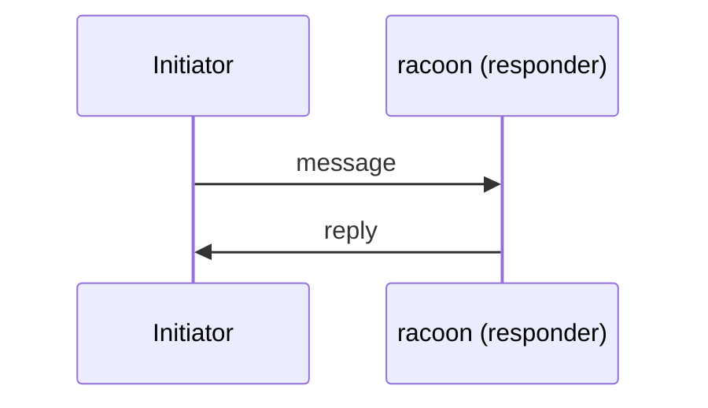

<!--
Use this template for a substantial feature that needs a written design
before implementation begins. The finished issue is a lightweight RFC /
Epic: an engineering design specification, not a feature request. It must
be detailed enough that several contributors can implement parts of it
independently while staying architecturally consistent, and it should
remain valuable as documentation long after implementation has completed.

When to use what:

- Bugs and small improvements: use a plain Issue or go straight to a PR.
- A unit of work implementing an accepted design: use the
  "Implementation task" template (.github/ISSUE_TEMPLATE/implementation.md).
- Architectural decisions that must be permanently recorded in the tree
  (on-wire behaviour, racoon.conf surface, cryptography, public APIs,
  cross-cutting structure): also write an RFC under docs/rfcs/
  (see docs/rfcs/README.md) and link it from this issue. This Feature
  Issue tracks the feature end to end; the RFC records the decision.

Style expectations:

- Write like an engineering RFC. Use precise technical language and avoid
  marketing language and unnecessary verbosity.
- Justify architectural decisions; state assumptions, trade-offs and
  risks explicitly. Clearly distinguish assumptions from confirmed facts.
- Avoid speculative implementation details; they belong in code review.
- Prefer Mermaid diagrams over long textual explanations where they
  improve clarity; use tables where they improve readability.
- Every numbered section below is expected. A section that genuinely does
  not apply may be marked "N/A" with a one-line reason, but never delete
  it. Section 4 (Non-goals) and section 10 (Security Considerations) are
  mandatory and may not be N/A.

Delete the guidance comments as you fill in the sections.
-->

## 1. Summary

<!-- One concise paragraph: what problem the feature solves, why it
     matters, and who benefits (operators, packagers, interop peers,
     future maintainers). -->

## 2. Motivation

<!-- Current limitations and concrete pain points. What workarounds exist
     today and why they are insufficient. Why the change is justified now
     rather than later. Ground it in real cases: interoperability with
     specific peers, a class of bugs, a maintenance burden. -->

## 3. Goals

<!-- Explicit, testable goals. Examples: improve maintainability, reduce
     complexity, improve interoperability, support future extensions,
     preserve backwards compatibility where appropriate. -->

-
-

## 4. Non-goals

<!-- Mandatory. Explicitly list what this feature will NOT attempt to
     solve. Naming these prevents scope creep and sets reviewer
     expectations. -->

-
-

## 5. Background

<!-- Enough technical background that a contributor unfamiliar with the
     subsystem can follow the rest of the document:
     - existing architecture (point at the files/modules involved,
       e.g. src/racoon/, src/libipsec/, src/setkey/),
     - relevant standards (RFCs, vendor behaviour),
     - existing APIs and configuration directives,
     - historical constraints (KAME heritage, portability, OpenSSL
       versions),
     - interoperability requirements (Apple/Cisco-compatible clients,
       legacy devices).
     Include references where useful; collect them in section 18. -->

## 6. Proposed Design

<!-- The largest section. Describe the proposed architecture in enough
     detail that independent contributors converge on the same shape.
     Use subsections. Cover:
     - component responsibilities and ownership,
     - interactions between components,
     - lifecycle and state transitions,
     - error handling,
     - extensibility.
     Include Mermaid diagrams whenever they improve clarity: component
     diagram, sequence diagram, state machine, flow chart. Example:

-->

### 6.1 Overview

### 6.2 Components and responsibilities

### 6.3 Lifecycle and state transitions

### 6.4 Error handling

### 6.5 Extensibility

## 7. Public Interfaces

<!-- Every user-visible interface, with examples where appropriate:
     - CLI behaviour (racoon, setkey, racoonctl),
     - configuration (racoon.conf directives: syntax, semantics,
       defaults),
     - libraries and APIs (libipsec, PF_KEY),
     - file formats,
     - network protocol behaviour visible to peers. -->

## 8. Internal Design

<!-- Internal modules: responsibilities, dependencies, interfaces between
     them, and the invariants each module maintains. Stay at design
     altitude; implementation details belong in code. -->

## 9. Compatibility

<!-- Backwards compatibility (existing configs, on-wire behaviour with
     deployed peers, API/ABI), forwards compatibility, migration path for
     existing deployments, and the deprecation strategy for anything being
     replaced. Label the issue breaking-change if applicable. -->

## 10. Security Considerations

<!-- Mandatory. Discuss:
     - attack surface (new parsers, new network-facing code),
     - privilege boundaries,
     - authentication and authorization,
     - cryptography (algorithms, defaults, OpenSSL usage),
     - denial-of-service resistance,
     - secure defaults. -->

## 11. Performance Considerations

<!-- Expected performance and scalability (e.g. number of concurrent SAs
     or negotiations), resource usage, startup time, memory footprint,
     concurrency model. State how claims will be measured. -->

## 12. Testing Strategy

<!-- Unit tests, integration tests, interoperability tests, regression
     tests, CI requirements, and failure injection. Where networking is
     involved, describe realistic integration topologies (peers, NAT,
     address families, roles) and which peer implementations interop will
     be verified against. -->

## 13. Alternatives Considered

<!-- Realistic alternatives, including "do nothing". For each: its
     advantages, its disadvantages, and the reason for rejection. This is
     where most of the long-term value of the document lives. -->

## 14. Open Questions

<!-- Unresolved design questions; these become discussion points during
     review. Move each answer into the relevant section as it is
     resolved. -->

-

## 15. Future Work

<!-- Ideas intentionally deferred. Distinguish "deferred by choice" from
     "blocked by an open question". -->

-

## 16. Acceptance Criteria

<!-- A checklist of objectively verifiable conditions under which the
     feature is complete and correct. These items are copied into the
     implementation task issues, so make each one independently
     checkable. -->

- [ ]
- [ ]

## 17. Implementation Plan

<!-- Logical milestones, each producing a working intermediate result
     (buildable, testable, ideally shippable). Each milestone typically
     becomes one or more implementation task issues referencing this
     Epic. -->

1.
2.

## 18. References

<!-- RFCs and standards, related GitHub issues and pull requests, prior
     discussions, the docs/rfcs/ RFC recording the decision (if one
     exists), and relevant documentation. -->

-
