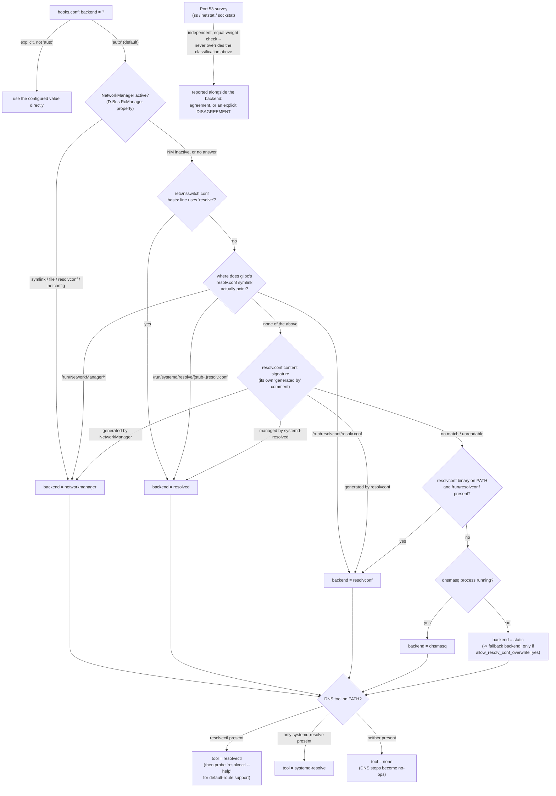

# Architecture: the split-DNS/routing hooks

This document is about one part of the tree: `src/racoon/scripts/` — the
shell that runs when a road-warrior IKEv1 tunnel comes up or down, and
decides how to route traffic and configure DNS for it. It is not a general
tour of `racoon`/`setkey`.

You're reading this because a VPN reconnect broke split-DNS on a distro
upgrade you didn't schedule, or because `racoon0` won't come up, or because
you're about to fix a bug on a distro this project hasn't seen yet. By the
end, you should be able to open `racoon-hook-lib.sh`, find the function
responsible, understand why it does what it does, and fix it — including
running the right test — without asking anyone.

## 1. What problem this solves

When racoon finishes IKEv1 Phase 1 and Mode Config, it hands off to a shell
script (`phase1-up.sh`) with a handful of environment variables: an
internal IP address, some split-include networks, maybe some internal DNS
servers and search domains. Somebody has to turn that into an actual
working tunnel: a route to each internal network, IPsec policy telling the
kernel to encrypt that traffic, and — if DNS servers were sent — the
system's resolver has to start using them for the domains behind the VPN.

The routing and IPsec-policy part is a few `ip route` and `setkey`
invocations. The DNS part is where it gets complicated, because "the
system's resolver" is not one thing. Depending on the distro, the
installed packages, and how they were configured, DNS on a given Linux
machine might be handled by:

- **systemd-resolved**, controlled by `resolvectl` on anything reasonably
  current, or by its older flag-based predecessor `systemd-resolve` on
  anything from before systemd 239 (Ubuntu Bionic, for instance).
- **NetworkManager**, which may delegate to systemd-resolved, to its own
  bundled dnsmasq, or just write `/etc/resolv.conf` itself, depending on
  its `dns=` setting.
- **classic resolvconf** (the Debian/Ubuntu package, not systemd's
  `resolvectl`), which manages `/etc/resolv.conf` via symlinks from
  scripts registered under `/etc/resolvconf/`.
- **plain dnsmasq**, running standalone with no other manager involved.

These don't just have different config files — they don't agree on
*whether they can even do per-domain routing at all*. Tell
systemd-resolved "route `corp.example.com` through this DNS server and
nothing else" and it will honour that. Tell a NetworkManager profile with
`dns=default` the same thing and there's no mechanism for it — every
resolver becomes global, and the best you get is a warning explaining why.

None of this is knowable by reading `/etc/os-release`. Two machines
running the same distro release can have different DNS managers installed
and configured differently. So before anything else, the hook has to
*look*: what's actually installed, what's actually running, what does the
DNS config actually say right now. Only after that can it decide what to
run.

The same problem, smaller, applies to the interface and address that
anchor the tunnel: it needs a stable local address to route split-include
traffic through, and something has to own the dummy interface that
address lives on — which again depends on whether NetworkManager is
running and willing to manage it.

That's the whole reason this is the better part of 3,000 lines of shell
(`racoon-hook-lib.sh`, `phase1-up.sh`, `phase1-down.sh`,
`racoon-dns-detect` combined) rather than a dozen lines calling `resolvectl
dns`. Everything from here on is really just: detect properly, decide
based on what you found, and keep a precise record of what you did so it
can be undone.

## 2. Survey → plan → apply: a habit worth having yourself

This isn't a proprietary architecture invented for this project — it's a
general technique for any script that changes system state and needs to
be trustworthy. Worth reaching for in your own scripts, not just reading
about here.

- **Survey**: look, don't touch. Read files, ask D-Bus, run
  `--help`/`--version`, check what's listening. Nothing here changes
  anything, so it's always safe to run, even repeatedly, even as an
  unprivileged user.
- **Plan**: given the survey and what the VPN gateway sent, decide what to
  do — but write it down as a list of steps rather than doing it
  immediately. Each step: an id, a type, whether it's required or
  optional, a human description, the command that applies it, and the
  command that undoes it.
- **Apply**: walk the list, one step at a time, run each command, and
  record the outcome — success, failure, or skipped-and-why — for *every*
  step, including the ones that never got to run because an earlier
  required step failed.

Two things fall out of this split for free, which is the actual payoff:

**`--dry-run` is just "plan, then print, then stop."** Because building
the plan never touches the system, `racoon-dns-detect --dry-run` can show
exactly what would happen — the real commands, in the real order — without
root, without an active tunnel, and without any special "simulation mode"
bolted on afterwards. It's the same plan-building code phase1-up.sh uses.

**The report is a complete, honest answer to "what did this actually do to
my machine."** In the old model — one long script, `set -e`, failures
propagate as an early exit — a failure two steps in silently skips
everything after it, and you find out by testing the VPN, not by reading
output. Here, every step's outcome is recorded, including the ones that
never ran, so the report is never partial by omission. Section 3 is about
reading that report.

## 3. Reading a report

This is the primary diagnostic skill. If you're troubleshooting, **start
here**, and only go into the shell if the report doesn't tell you enough —
it usually will.

Here's a real one, captured from a live NetworkManager + `resolvectl`
roadwarrior (Arch/Manjaro), reproduced verbatim except for the timestamp:

```
racoon phase1-up report -- 2026-07-21T00:25:20+02:00
backend=networkmanager dns_tool=resolvectl iface=wlp0s20f3 internal=192.168.66.20 routes=10.66.0.0/24 192.168.66.0/24 192.168.83.0/24 10.66.0.6/32 dns=10.66.0.6 domains=nepomuc.de dummy_owner=nm
[ SKIPPED   ] create dummy interface racoon0
              reason: the networkmanager backend creates its own dummy interface as part of the connection profile
[ SKIPPED   ] add 192.168.66.20/32 to racoon0
              reason: the networkmanager backend creates its own dummy interface as part of the connection profile
[ ok        ] create NetworkManager DNS profile on racoon0 (dns=10.66.0.6 domains=nepomuc.de)
[ ok        ] route 10.66.0.0/24 dev wlp0s20f3 src 192.168.66.20
[ ok        ] route 192.168.66.0/24 dev wlp0s20f3 src 192.168.66.20
[ ok        ] route 192.168.83.0/24 dev wlp0s20f3 src 192.168.66.20
[ ok        ] route 10.66.0.6/32 dev wlp0s20f3 src 192.168.66.20
[ ok        ] install outbound SPD 192.168.66.20/32 -> 10.66.0.0/24
[ ok        ] install inbound SPD 10.66.0.0/24 -> 192.168.66.20/32
[ ok        ] install outbound SPD 192.168.66.20/32 -> 192.168.66.0/24
[ ok        ] install inbound SPD 192.168.66.0/24 -> 192.168.66.20/32
[ ok        ] install outbound SPD 192.168.66.20/32 -> 192.168.83.0/24
[ ok        ] install inbound SPD 192.168.83.0/24 -> 192.168.66.20/32
[ ok        ] install outbound SPD 192.168.66.20/32 -> 10.66.0.6/32
[ ok        ] install inbound SPD 10.66.0.6/32 -> 192.168.66.20/32
  result: PARTIAL (13 ok, 2 skipped, 0 failed, 0 not attempted) -- policy 'warn'
```

Reading it top to bottom:

**Header line.** `backend=networkmanager dns_tool=resolvectl` — what the
survey decided (section 5 covers how). `dummy_owner=nm` — who is expected
to own the dummy interface, which decides how it gets torn down later.
`routes=` / `dns=` / `domains=` — exactly what's about to be configured,
so you can check it against what the gateway actually sent before reading
any further.

**One line per step**, in the order the plan was built, with one of four
states:

- **`ok`** — ran, succeeded, and (where the step type has one) passed its
  post-check. Its undo command has been written to the state file.
- **`SKIPPED`** — never ran, on purpose, and always comes with a `reason:`
  line explaining why. Here: NetworkManager's own `connection add` creates
  the interface and address as part of one atomic profile, so the generic
  "create a dummy interface" and "add an address to it" steps have nothing
  to do for this backend. A skip is not a failure — check the `reason:`
  line, and unless it looks wrong, move on.
- **`FAILED`** — ran and didn't work, or reported success but a
  post-check found it had no real effect. Comes with `(exit N)` or `(reported
  success, but had no effect)`, and the `[trace]` log (`RACOON_HOOK_DEBUG=1`
  or `debug_level=2` in hooks.conf) has the exact command and its output
  right below the summary line.
- **`not-run`** — a required step failed, so everything after it in the
  plan is marked not-run without being attempted. No separate reason
  needed: it's downstream of the one `FAILED` line above it.

**The summary line** is the fast path: `result: OK` means everything that
was planned actually happened; `result: PARTIAL` means look for a
`SKIPPED` or `FAILED` line above. The counts in parentheses tell you
which, without reading the whole report — `(13 ok, 2 skipped, 0 failed, 0
not attempted)` here means the two skips are the whole story, nothing
actually went wrong. A report with any `failed` or `not attempted` count
above zero means the tunnel is either not working or working with a gap —
worth clicking through, not just glancing at "PARTIAL" and moving on.

That's 80% of real troubleshooting done without opening a single script.
Section 6 works through a case where the report genuinely can't tell you
enough on its own, and what to do next.

## 4. `racoon-dns-detect --detect` — run this before you touch anything

`racoon-dns-detect` is the survey and capability-probing logic exposed as
a standalone admin tool — no root, no active tunnel, changes nothing. Run
`--detect` first on any new or unfamiliar host, before assuming you know
what backend or DNS tool is in play.

Output below is real, not typed up by hand: produced by actually running
the script against a merge of two of this repo's own fixtures
(`tests/hooks/fixtures/05-nm-dns-default-systemd-resolved`'s NetworkManager
D-Bus/`--print-config` stubs and `11-resolved-stub-port53`'s `ss`/`/proc`
stubs), plus a `resolvectl --help` stub added on top so the capability
matrix has something to probe. Reproduce it yourself: copy both fixtures'
`bin/` and `root/` trees into one directory, add a `resolvectl` script to
`bin/` that prints a `--help` text containing the word `default-route`,
then run

```
$ PATH="$PWD/bin:$PATH" RACOON_HOOK_FS_ROOT="$PWD/root" racoon-dns-detect --detect --explain
racoon-dns-detect: resolv.conf landscape and split-DNS backend report
=======================================================================

Configured backend (hooks.conf): auto
Classified backend:              networkmanager
Name resolution actually reads:  /path/to/fixture/root/etc/resolv.conf

Evidence:
  nsswitch.conf hosts: line uses 'resolve'? no
  NetworkManager D-Bus RcManager property:   symlink
  NetworkManager D-Bus Mode property:        default
  DNS tool detected on PATH:                 resolvectl
  systemd version (systemctl --version):     <unknown>

DNS tool: resolvectl
Capability matrix:
  per_link_dns: yes
  routing_domains: yes
  default_route: yes
  revert: yes
  flush_caches: yes

Port 53 listeners:
  udp 127.0.0.53:53 -- pid=100 owner=/usr/lib/systemd/systemd-resolved class=stub (via ss)

DISAGREEMENT: port 53 survey vs. file/D-Bus classification
  file/D-Bus survey concluded: backend=networkmanager (evidence: nss_uses_resolve=no, glibc reads /path/to/fixture/root/etc/resolv.conf)
  port 53 survey concluded:    a systemd-resolved stub is bound to 127.0.0.53:53 (owner /usr/lib/systemd/systemd-resolved)
  Neither is authoritative here -- reported as found, not resolved automatically.
```

(`/path/to/fixture/root/etc/resolv.conf` above is `$RACOON_HOOK_FS_ROOT` plus
the real path, shown literally in the actual output too — `RACOON_HOOK_FS_ROOT`
only exists so fixtures can fake a filesystem without touching the real one;
on a real host it's unset and this line just reads `/etc/resolv.conf`.)

The **capability matrix** is the plainest possible idea done rigorously:
a table of what *this specific installed tool* can and cannot do, computed
fresh on every run, never assumed from a distro name or a version number.
`per_link_dns`, `routing_domains`, `revert` and `flush_caches` are
confirmed present in both `resolvectl` and `systemd-resolve` by their
respective systemd NEWS entries, so those are unconditional. `default_route`
is different: rather than assert a version cutoff nobody could confirm, the
code runs `resolvectl --help` and greps for the string `default-route` —
if it's not in the help text, the capability isn't there, full stop.

This is the sentence that makes the rest of this document's complexity
feel earned: **the same code has to run correctly on a five-year-old
Ubuntu LTS and this week's Arch, and those two systems don't just have
different tools installed — the tools that share a name accept different
arguments.** `resolvectl` and `systemd-resolve` are, formally, the same
tool at two different points in its life — confirmed against systemd's own
NEWS file, not inferred: v236's entry reads "The systemd-resolve command
line tool gained a new set of options --set-dns=, --set-domain=, ...
and --revert"; v239's reads "The systemd-resolve tool has been renamed to
resolvectl (it also remains available under the old name, for
compatibility), and its interface is now verb-based." "Same tool" is not "same
argument syntax." Section 6 is a live example of exactly this problem, one
level down, inside `nmcli` instead.

The last block above — port 53 listeners, and the `DISAGREEMENT` warning —
is a second, independent check: what's actually bound to port 53 right
now, regardless of what the file-based survey concluded. It doesn't
override the classified backend; it's printed alongside it, and if the two
disagree, both conclusions and their evidence are shown rather than one
silently winning. Section 5 shows where this sits relative to the rest of
the decision tree.

`--dry-run` extends this with the actual plan, using either your own
`--dns=`/`--domains=`/`--routes=`/`--iface=`/`--internal-addr=` values or
RFC 5737/6890 documentation-reserved sample values if you don't supply
any:

```
$ racoon-dns-detect --dry-run --explain \
    --dns=10.66.0.6 --domains=nepomuc.de --routes=10.66.0.0/24 \
    --iface=wlp0s20f3 --internal-addr=192.168.66.20
[...]
[required] nm_dns (nm_dummy_profile): create NetworkManager DNS profile on racoon0 (dns=10.66.0.6 domains=nepomuc.de)
    apply: nmcli connection delete racoon-vpn-dns >/dev/null 2>&1; ip link del "racoon0" >/dev/null 2>&1; nmcli connection add type dummy ifname "racoon0" con-name racoon-vpn-dns autoconnect no ipv4.method manual ipv4.addresses "192.168.66.20/32" ipv4.dns "10.66.0.6" ipv4.dns-search "~nepomuc.de" ipv4.dns-priority 50 ipv4.ignore-auto-dns yes ipv4.never-default yes ipv6.method ignore && nmcli connection up racoon-vpn-dns
    undo:  nmcli connection down racoon-vpn-dns >/dev/null 2>&1; nmcli connection delete racoon-vpn-dns >/dev/null 2>&1
```

One thing worth knowing before you read a `--dry-run` plan: it shows every
step as `[required]` or `[optional]`, never `SKIPPED` — skip decisions are
made by a step's *precondition* at apply time (section 3), which
`--dry-run` never runs, since running it would mean touching the system.
The plan is the static list; the report (section 3) is what actually
happened.

## 5. The decision tree



Two independent decisions happen here, plus one check that deliberately
sits outside both. The **backend** decision (left/top path) picks which of
`rhook_plan_dns_networkmanager`/`_resolved`/`_resolvconf`/`_dnsmasq`/
`_fallback` builds the DNS steps — it never looks at which DNS *tool* is
installed. The **tool** decision (`resolvectl` vs `systemd-resolve` vs
none) only matters when the backend is `resolved`; for every other
backend it's detected and reported (you'll see `dns_tool=resolvectl` in a
`networkmanager`-backend report too) but not actually used to build any
command, since `nmcli`, not `resolvectl`, is what the `networkmanager`
backend's own steps run. The **port 53 survey** is not a third input to
either decision — it never feeds back into backend or tool selection at
all — it's a standing check reported for human judgement when it
disagrees with what the file-based survey concluded.

**A live example of the `RC` branch: not just Arch Linux.** The `RC`
decision at the top of the diagram only reaches `unmanaged` — the value
that lets classification fall through past `networkmanager` to
`resolved` — when NetworkManager's own `rc-manager` setting is `auto`
*and* it has detected `systemd-resolved` as the active DNS plugin (both
conditions, confirmed against `src/core/dns/nm-dns-manager.c`'s
`init_resolv_conf_mode()` — the `unmanaged` override lives entirely
inside the branch handling `rc_manager == auto`; any other compiled or
configured value skips that check unconditionally, regardless of what
DNS plugin is actually active). Found live, comparing an Ubuntu Noble
and an Arch roadwarrior with `dns=systemd-resolved` configured
identically on both and `systemd-resolved` correctly enabled and running
on both: Noble classified `resolved`, Arch stubbornly kept classifying
`networkmanager`. `NetworkManager --print-config` on each explained it —
a `#`-commented value in that output is NetworkManager's *effective
default*, not something set in any config file:

```
Ubuntu Noble  (NetworkManager 1.46.0):  # rc-manager=
Arch Linux    (NetworkManager 1.56.1):  # rc-manager=symlink
```

Confirmed against NetworkManager's own build options
(`meson_options.txt`'s `config_dns_rc_manager_default`: allowed values
`auto`/`symlink`/`file`/`netconfig`/`resolvconf`, upstream default
`auto`): Arch's own `networkmanager` package is built with that default
pinned to `symlink` instead of upstream's `auto`. This is a packaging
choice, not a bug in NetworkManager or in this hook set — but it
silently caps a stock Arch install on the `networkmanager` backend's
flat, non-isolated DNS (the "cannot be isolated" warning from section
4), even with `systemd-resolved` fully enabled and working. **The same
divergence was independently found on Ubuntu Bionic** during this
project's own live roadwarrior testing (operator-confirmed, `rc-manager`
compiled/pinned away from `auto` there too) — this is not an Arch
peculiarity, and should be checked on any distro before assuming
`resolved` classification will "just work" once `systemd-resolved` is
enabled.

*Why a packager would pin this at all*: traced to a real, public
NetworkManager issue (freedesktop.org GitLab issue #629, first comment
activity 10 Jan 2021, closed the same day as a config issue, then
reopened by NM maintainer Thomas Haller on 4 Feb 2021 as "probably a
packaging bug"; the issue's own creation date is not independently
confirmed here, only the dated comment activity). The root cause: NM's
`auto` mode resolves to "use `resolvconf`, if built with `resolvconf`
support, unless `systemd-resolved` is detected" — when a distro ships an
*optional* `systemd-resolvconf` package (providing `/usr/bin/resolvconf`)
that a user has installed but left disabled, NM finds `resolvconf` in
`$PATH`, assumes it's usable, and a DNS write fails outright. Haller's
own fix guidance, quoted from that thread: *"For the distribution, when
building the package you can select the default:
`--with-config-dns-rc-manager-default` configure option... on the other
hand, if you build NetworkManager with `--with-resolvconf=no`, then
`auto` also doesn't mean that."* Fedora's own spec file (same repo,
`contrib/fedora/rpm/NetworkManager.spec`) shows the range of choices
downstream packagers actually made:

```
%if 0%{?fedora} || 0%{?rhel} > 7
%if 0%{?fedora} || 0%{?rhel} > 8
%global dns_rc_manager_default auto
%else
%global dns_rc_manager_default symlink    # RHEL 8 specifically
%endif
%else
%global dns_rc_manager_default file       # generic non-Fedora/RHEL fallback
%endif
```

— i.e. even within one packaging family, the compiled default varies by
release. Arch's and Bionic's own choices of `symlink` are each that
distro's own defensive reaction to the same 2021 ambiguity, not
something forced on them by any upstream file.

The fix is on the NetworkManager side, not this project's — pin
`rc-manager` explicitly rather than relying on the compiled default:

```
# /etc/NetworkManager/conf.d/dns.conf
[main]
dns=systemd-resolved
rc-manager=unmanaged
```

then `sudo systemctl restart NetworkManager` so it picks up the new
file. Confirmed working end to end on real Arch, Noble, and Bionic
roadwarriors: `RcManager` reports `unmanaged`, `racoon-dns-detect
--detect` classifies `resolved`, and `resolvectl status` shows the same
`~domain` routing-only isolation on `racoon0` on all three.

**`rc-manager=auto` is not a distinct third option once
`systemd-resolved` is your active DNS mode** — per `init_resolv_conf_mode()`
above, `auto` collapses to exactly `unmanaged` in that case,
deterministically. Confirmed live on Arch and Noble roadwarriors freshly
rebooted with `rc-manager=auto` explicitly configured: `busctl
get-property ... RcManager` still reported `"unmanaged"`, matching the
source-level prediction exactly, not a stale-config artifact. Setting
`rc-manager=unmanaged` explicitly (above) and leaving it at `auto` behave
identically on any host where `systemd-resolved` is the active plugin;
the explicit form is only strictly necessary on a host whose compiled
default has been pinned away from `auto` in the first place (Arch,
Bionic, RHEL 8, as above).

Treat "this distro defaults to `symlink`" as a snapshot, not a
guarantee — it's a packaging choice that could change in either direction
on any distro, as the Fedora/RHEL table above already shows happening
within a single packaging family. The durable, portable check is the
method, not any one fact: `NetworkManager --print-config | grep
rc-manager` (or `busctl get-property org.freedesktop.NetworkManager
/org/freedesktop/NetworkManager/DnsManager
org.freedesktop.NetworkManager.DnsManager RcManager` directly) tells you
immediately which path your own host is on, whatever distro it is.

## 6. Worked example: `ipv6.method=disabled` rejected on Ubuntu Bionic

This walks a real bug, found live and already fixed in this project, the
way a sysadmin would actually hit it — not a constructed example.

### 6.1 The symptom

VPN connects. The report shows one `FAILED` step, right where DNS gets
configured, and the tunnel comes up with routes and SPD entries never
applied — not "step X returned exit code 1" in the abstract, but: the
whole connection quietly does nothing useful, on a machine where the exact
same hooks.conf worked fine on a different, newer Linux box the day
before.

### 6.2 Where to look first: the report

Here's what it actually said, captured live from an Ubuntu Bionic
32-bit roadwarrior with NetworkManager active:

```
racoon phase1-up report -- 2026-07-20T23:46:10+02:00
backend=networkmanager dns_tool=systemd-resolve iface=enp1s0 internal=192.168.66.20 routes=10.66.0.0/24 192.168.66.0/24 192.168.83.0/24 10.66.0.6/32 dns=10.66.0.6 domains=nepomuc.de
[ SKIPPED   ] create dummy interface racoon0
              reason: the networkmanager backend creates its own dummy interface as part of the connection profile
[ SKIPPED   ] add 192.168.66.20/32 to racoon0
              reason: the networkmanager backend creates its own dummy interface as part of the connection profile
[ FAILED    ] create NetworkManager DNS profile on racoon0 (dns=10.66.0.6 domains=nepomuc.de) (exit 2)
[ not-run   ] route 10.66.0.0/24 dev enp1s0 src 192.168.66.20
[ not-run   ] route 192.168.66.0/24 dev enp1s0 src 192.168.66.20
[ not-run   ] route 192.168.83.0/24 dev enp1s0 src 192.168.66.20
[ not-run   ] route 10.66.0.6/32 dev enp1s0 src 192.168.66.20
[ not-run   ] install outbound SPD 192.168.66.20/32 -> 10.66.0.0/24
[ not-run   ] install inbound SPD 10.66.0.0/24 -> 192.168.66.20/32
[...]
  result: PARTIAL (0 ok, 2 skipped, 1 failed, 12 not attempted) -- policy 'warn'
```

This is honest about what it can and can't tell you: `(exit 2)` says the
command failed and its exit code, but not *why* — for that you need the
`[trace]` log line right above the report (`RACOON_HOOK_DEBUG=1`, or
`debug_level=2` in hooks.conf), which has the exact command and its
captured output:

```
[trace]   output: Error: failed to modify ipv6.method: 'disabled' not among [ignore, auto, dhcp, link-local, manual, shared].
```

Worth admitting plainly: this class of bug — a tool rejecting one specific
property value — does not get its own dedicated diagnosis in the report.
It surfaces as a generic `FAILED (exit N)`, same as any other command
failure. The trace log is what actually tells you it's an `nmcli`
complaint about `ipv6.method`, not a routing or permissions problem.

### 6.3 Confirming it by hand

Using only `nmcli`, which you already know: try the same property value
directly, with a throwaway connection rather than the hook's real one.

```
$ nmcli connection add type dummy ifname test-verify con-name test-verify autoconnect no ipv6.method disabled
Error: failed to modify ipv6.method: 'disabled' not among [ignore, auto, dhcp, link-local, manual, shared].
```

The error text above is the literal, verified text from the real failure
(copied from the trace log, not retyped from memory); the minimal
reproduction command around it isn't the hook's actual multi-property
invocation, but `nmcli` validates each property's value independently, so
a minimal repro fails on the same property the same way. This confirms
it's `nmcli`/NetworkManager rejecting the value, not something specific to
how the hook invokes it. Clean up with `nmcli connection delete
test-verify` if the command partially succeeded on your system (on Bionic
it doesn't get that far). `nmcli --version` on the affected host showed
`1.10.6` — a five-year-old NetworkManager, much older than
whatever generated the working config on the other machine.

### 6.4 Finding the one function responsible

You don't need to be told the function name to find it — that's the
actual skill. `grep -n 'ipv6.method' src/racoon/scripts/racoon-hook-lib.sh`
finds one hit, inside `rhook_plan_dns_networkmanager()`. More generally:
whenever a report or trace log shows you a real command line, `grep` the
literal, distinctive part of it (`nmcli connection add`, a particular flag,
an error-message fragment if the source echoes it) against
`racoon-hook-lib.sh` — every command this hook set runs is built in
exactly one place, so there is always exactly one function to find. That's
the method; it works for a different symptom and a different function the
same way.

### 6.5 Understanding why it's wrong

In `nmcli`'s own terms, `ipv6.method` is not one setting with two spellings
for "off" — `ignore` and `disabled` mean different things, and only one of
them existed in the NetworkManager version this Bionic install shipped.
`ignore` means NetworkManager makes no IPv6 configuration decisions for
this connection at all — the kernel's own defaults apply, which can still
mean a link-local (`fe80::`) address appears via SLAAC. `disabled`, added
to NetworkManager later than `ignore`, goes further and turns IPv6 off for
the interface at the kernel level, entirely. Bionic's `nmcli` (1.10.6)
predates the `disabled` value's introduction; its own error message says
exactly what it does understand:
`not among [ignore, auto, dhcp, link-local, manual, shared]` — six values,
no `disabled`. The hook was asking for a value that simply didn't exist
yet on this NetworkManager version, and `nmcli` rejected the entire
`connection add` rather than partially applying it — which is why nothing
after it in the plan ever ran either.

### 6.6 Making the fix

One word, in `rhook_plan_dns_networkmanager()`
(`src/racoon/scripts/racoon-hook-lib.sh`):

```diff
- ipv4.never-default yes ipv6.method disabled
+ ipv4.never-default yes ipv6.method ignore
```

`ignore` has been present since NetworkManager's oldest supported
releases, so it works on Bionic's 1.10.6 and on whatever ships `disabled`
too. The trade-off is honest, not hidden: the dummy interface may end up
with a harmless link-local IPv6 address it wouldn't have had under
`disabled`. That's acceptable here specifically because this hook never
routes IPv6 traffic through that interface at all — only an IPv4 address
for DNS and route `src=`.

### 6.7 Proving it

**By hand**, the same `nmcli` command with the fixed value:

```
$ nmcli connection add type dummy ifname test-verify con-name test-verify autoconnect no ipv6.method ignore
```

This succeeds where `disabled` failed (confirmed live: the identical
`connection add ... ipv6.method ignore` line is what actually ran on the
Arch/Manjaro host in section 4's `--dry-run` output, and its real
NetworkManager log showed `Connection 'racoon-vpn-dns' (2578515a-…)
successfully added.` in response — the exact success message `nmcli`
emits). Clean up with `nmcli connection delete test-verify`.

To see the trade-off from step 6 rather than just take it on faith, check
`ip -6 addr show racoon0` after the tunnel is up: standard Linux interface
behaviour is to assign a link-local (`fe80::/64`) address to any interface
brought up without IPv6 explicitly disabled, which is exactly what
`ignore` leaves in place and `disabled` would have suppressed.
<!-- UNVERIFIED: the literal ip -6 addr show output on racoon0 specifically -- not captured live in this project's own testing so far; the general kernel behaviour it relies on (link-local autoconfiguration on any non-IPv6-disabled interface) is standard and not project-specific. -->

**By test.** This exact property string is asserted in
`tests/hooks/test-plan-builder.sh`, in the `networkmanager` backend
section:

```sh
assert_contains "nm profile: ipv6.method is ignore, not disabled (unsupported on NM 1.10.x / Ubuntu Bionic)" \
	"$nm_cmd" "ipv6.method ignore"
assert_not_contains "nm profile: never ipv6.method disabled (rejected by NM 1.10.x / Ubuntu Bionic)" \
	"$nm_cmd" "ipv6.method disabled"
```

Run just this suite with:

```
sh tests/hooks/test-plan-builder.sh
```

To add a fixture/assertion for a *different* version-skew property, the
pattern is the same: build the plan (`rhook_build_plan` is already called
earlier in the same test file section), pull the command string for the
step you care about with `plan_field <step-id> 5 "$PLAN"` (field 5 is the
apply command — see `rhook_plan_add`'s own comment in
`racoon-hook-lib.sh` for the six-field layout), then `assert_contains`/
`assert_not_contains` the property and value you expect. To prove a new
assertion actually catches the bug (not just passes by coincidence),
temporarily revert the fix locally (`git stash push --
src/racoon/scripts/racoon-hook-lib.sh`) and confirm the suite fails, then
`git stash pop` to restore it.

### 6.8 What class of bug this was

Two tools, or two versions of the same tool, share a name or a property
name but not its accepted values — `resolvectl`/`systemd-resolve` (section
4) and `nmcli`'s own `ipv6.method` here are the same class of problem at
different layers. The codebase's general answer, stated plainly: **probe
capability, never assume it from a version number.** Section 4's
capability matrix is this principle applied deliberately, ahead of time,
to `resolvectl` vs `systemd-resolve`. This fix is the same principle
applied reactively, after a live failure, to one `nmcli` property — and
it's exactly the kind of gap a capability-matrix-style check doesn't yet
cover for `nmcli` itself (see section 8 below). Next time the report shows
a `FAILED` step with an unfamiliar tool complaint in the trace log, this
is the method walked above (6.1–6.7): state the symptom, read the report,
confirm it by hand, find the one function via `grep`, understand the
tool's own distinction between the two values, make the fix, prove it
both ways — then name the class of bug, same as this step.

## 7. Map: where things live

| Location | Purpose | Look here if… |
|---|---|---|
| `rhook_survey_build`/`rhook_survey_file` (`racoon-hook-lib.sh`) | Reads the whole resolv.conf-related file/symlink landscape into one snapshot | The survey seems to miss a file your setup relies on |
| `rhook_survey_classify_backend` | The backend decision (section 5, left path) | The wrong backend gets picked |
| `rhook_survey_nm_active`/`rhook_nm_dbus_prop` | NetworkManager active-state and D-Bus property reads | NM-related detection looks wrong, or a D-Bus call is unexpectedly slow/blocking |
| `rhook_survey_port53_*` | Port 53 listener survey via `ss`/`netstat`/`sockstat` | The `DISAGREEMENT` warning fires, or a real listener isn't detected |
| `rhook_dns_tool_detect`/`rhook_dns_cap` | `resolvectl` vs `systemd-resolve` selection, capability matrix (section 4) | A capability is reported wrong, or the wrong tool gets picked |
| `rhook_dns_emit_*` | One function per DNS operation, one case-branch per tool, the literal command strings for the `resolved` backend | The `resolved` backend generates wrong `resolvectl`/`systemd-resolve` syntax |
| `rhook_valid_*`/`rhook_validate_*_list` (§4) | Whitelist validation of every Mode Config value before it's used | A legitimate gateway-sent value gets rejected, or an injection vector needs a regression test |
| `rhook_build_plan` | Assembles the backend-independent parts of the plan (dummy iface/addr, routes, SPD) and dispatches to the per-backend DNS planner | Step *order* is wrong (the route/prefsrc-ordering bug lived here) |
| `rhook_plan_dns_networkmanager`/`_resolved`/`_resolvconf`/`_dnsmasq`/`_fallback` | One function per backend: the actual apply/undo command strings for that backend's DNS configuration | A specific backend's command syntax is wrong (section 6's `ipv6.method` fix lives in `_networkmanager`) |
| `rhook_plan_spd` | SPD entry planning (tunnel selectors) | SPD selectors look wrong, or ports/addresses are malformed |
| `rhook_ensure_dummy_iface` | Idempotent dummy-interface creation | `racoon0` fails to come up after a non-clean stop |
| `rhook_run_step` | The one place a plan step's command is `eval`'d; precondition/postcondition dispatch | You need to understand why a step is `ok`/`SKIPPED`/`FAILED` |
| `rhook_apply_plan` | Runs the whole plan; in-transaction DNS rollback on a required-step failure | A partial-failure rollback isn't undoing what you expect |
| `rhook_undo_replay` | `phase1-down`'s entire teardown logic: reverse-order replay of the state file | Teardown isn't undoing something, or undoes things in the wrong order |
| `rhook_state_*` | State file I/O; `rhook_state_own_generation()` matches a teardown to its own generation by exact `IKE_COOKIE` (issue #90), not by arrival order | Overlapping reconnects (or a leftover orphan for the same peer) confuse which generation gets torn down |
| `rhook_emit_report`/`rhook_report_line` | Assembles and prints the report (section 3) | You want to change what the report shows |
| `phase1-up.sh` | Thin wrapper: Mode Config guard, outbound-interface detection, input validation, calls build/apply | Something *upstream* of the library (Mode Config parsing itself) looks wrong |
| `phase1-down.sh` | Thin wrapper: pure undo replay, no re-derivation of anything | The teardown invocation itself, not the replay logic, looks wrong |
| `racoon-dns-detect` | Admin CLI: survey, capability matrix, `--dry-run` plan preview, no root, no tunnel needed | You want to test detection/planning without touching the system (section 4) |
| `tests/hooks/test-lib-smoke.sh` | Plan/apply/report/state machinery in isolation | You changed core plan/apply/state logic |
| `tests/hooks/test-validation.sh` | §4 input validators, including named injection vectors | You changed a validator, or found a new injection vector |
| `tests/hooks/test-survey-fixtures.sh` + `fixtures/` | Fixture-driven §7 survey tests: each subdirectory is a fake filesystem tree + stub commands | You're adding support for a new resolv.conf layout or distro |
| `tests/hooks/test-dns-emitters.sh` | §6 capability matrix + emitter command-line output, per tool/capability | You changed a `rhook_dns_emit_*`/`rhook_dns_cap` function |
| `tests/hooks/test-plan-builder.sh` | Exact step sequence/criticality/command strings per backend | You changed a `rhook_plan_*` function (section 6's home suite) |
| `tests/hooks/test-dns-detect-cli.sh` | `racoon-dns-detect` CLI argument parsing and output smoke tests | You changed the CLI's own flags or output format |
| `tests/hooks/test-phase1-up.sh` | End-to-end `phase1-up.sh` tests via stub `ip`/`nmcli`/`setkey` | You changed `phase1-up.sh` itself, or need to prove an end-to-end fix |
| `tests/hooks/test-phase1-roundtrip.sh` | Full apply → teardown round trip via the real hook scripts back to back | You changed anything touching both `phase1-up.sh` and `phase1-down.sh` |

## 8. Known rough edges

Stated plainly, because a document that hides its own gaps is worth less,
not more:

- **Live-tested backends so far: `resolved` and `networkmanager` only** —
  both on real Ubuntu Bionic and Arch/Manjaro roadwarriors. The
  `resolvconf` backend, NetworkManager's own `dnsmasq` DNS plugin mode,
  and the opt-in `fallback` (direct `/etc/resolv.conf` overwrite, gated
  behind `allow_resolv_conf_overwrite=yes`) backend have only ever been
  exercised against stubs in the test suite, never against the real
  tools on a live host.
- **The ACQUIRE-provenance investigation is resolved: Branch B.** 8 live
  runs across Bionic, Noble, and Arch (`networkmanager` and `resolved`
  backends both represented) all confirm no external mechanism reinstalls
  or leaves behind an SPD policy after a clean teardown — on-demand
  reconnection after disconnect simply isn't implemented, which is the
  full explanation for what originally looked like a reconnect loop. The
  very first two test archives (before the investigation script itself
  was hardened) did show a real `ACQUIRE`; two sufficient causes were
  present in those archives (test-script contamination, and the F3/F4
  unscoped-resolver path), both fixed before the 8 clean runs, and the
  evidence cannot isolate which one actually explains the original
  symptom — see `doc/dev/teardown-investigation.md`'s "§F resolved"
  section for the full reasoning and why this doesn't affect the verdict.
- **Fixed: the FIFO generation-matching gap in `phase1-down.sh`'s
  state-file lookup (issue #90).** `rhook_state_oldest_unconsumed()` used
  to pick the oldest *live* (never-consumed) state file for a peer, not
  necessarily the current session's own — `rhook_state_reap()`
  deliberately never deletes live files, only aged `.consumed` ones, so a
  session that's never cleanly torn down left a permanent orphan behind
  that a later, unrelated session's own teardown could wrongly consume.
  Found on a real, reused Arch host (5 accumulated generations, only 2
  consumed); invisible in every Task F test run because every session
  used byte-identical `racoon.conf`, so consuming the "wrong" (orphaned)
  generation still happened to produce a correct real-world teardown in
  that setup. Fixed by giving `phase1-down.sh` an exact correlator instead
  of a heuristic: `script_hook()` (`src/racoon/isakmp.c`) now exports
  `IKE_COOKIE`, racoon's own ISAKMP cookie pair for the negotiation —
  unique per Phase 1 attempt, stable from `SCRIPT_PHASE1_UP` through
  `SCRIPT_PHASE1_DOWN` for the same `iph1` handle — and
  `rhook_state_own_generation()` matches on it exactly rather than by
  arrival order. `tests/hooks/test-phase1-roundtrip.sh`'s "lifo" scenario
  reproduces the exact failure mode at the fixture level (an orphaned
  generation and a same-peer teardown arriving out of arrival order).
  Confirming this against a real accumulated-orphan live host (the
  original Arch reproduction, re-run with the fix) is still an open
  follow-up — see the issue for tracking.
- **A handful of `# UNVERIFIED:` markers remain in `racoon-hook-lib.sh`**,
  each already mitigated defensively rather than left as a blind
  assumption — feature-probed instead of version-gated, or tolerant of
  either possible answer:
  - the exact header text `/run/NetworkManager/resolv.conf` itself
    writes (as opposed to `/etc/resolv.conf`'s copy of it);
  - which systemd release introduced `resolvectl default-route` (mitigated:
    feature-probed via `resolvectl --help`, so this is inert either way);
  - whether `systemd-resolve --set-dns=`/`--set-domain=` accept multiple
    values per flag occurrence, or must be repeated once per value
    (mitigated: always repeated once per value, the safe assumption
    either way);
  - NetBSD `sockstat(1)`'s exact column layout (modeled on FreeBSD's,
    unconfirmed against a real NetBSD host);
  - the exact byte-for-byte table layout of modern `resolvectl status`
    output (mitigated: matched by substring search, not a structural
    parser, so this is inert either way);
  - whether a routing-only domain (`~domain`) is echoed back in
    `resolvectl`/`systemd-resolve status` output with its leading `~` or
    without (mitigated: checked with the `~` stripped either way).

  See `doc/admin/1d1-split-dns-implementation-report.md` for the full detail
  on each and what would settle it.
- **No effectiveness postcondition exists yet for the `networkmanager`
  backend's own DNS profile step** — unlike the `resolved` backend, which
  re-checks `resolvectl status` after applying (section 6's bug would have
  looked identical either way, since it fails at the `nmcli` call itself,
  before any postcondition could run).
- **`nmcli` property-value compatibility is checked reactively, not via a
  capability matrix**, unlike `resolvectl`/`systemd-resolve` (section 4).
  The `ipv6.method` fix in section 6 was found live, not by a systematic
  check of every `nmcli connection add` property this hook set uses
  against older NetworkManager releases — there may be others.
