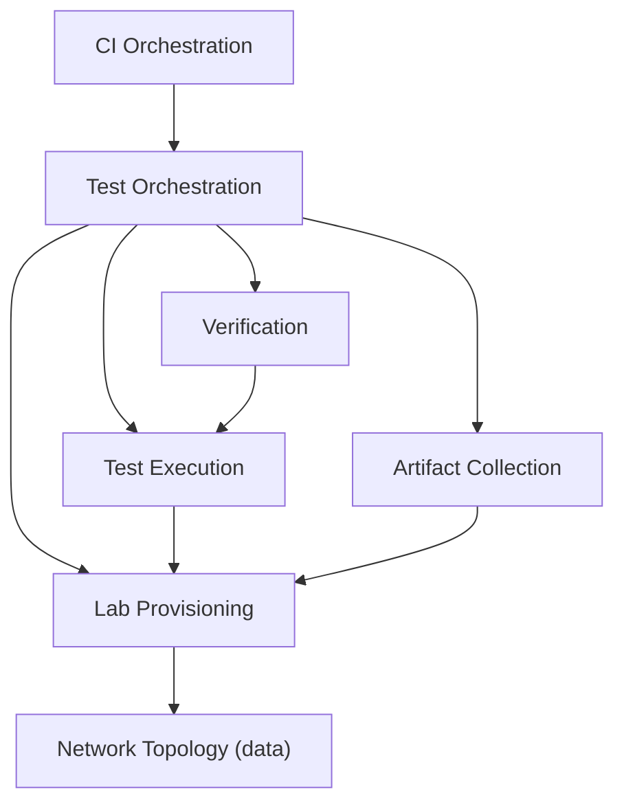
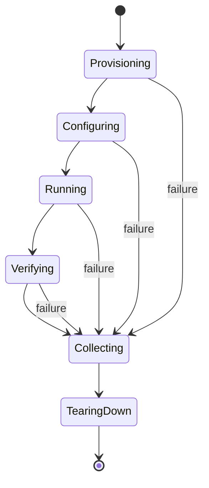

# RFC 0001: An Incus-Based Integration Testing Framework

## Status

Draft

## Authors

- Drafted via Claude Code at the request of @rdratlos

## Reviewers

- @rdratlos (decision)
- (open to community and domain-expert review — IKE/IPsec, Incus/LXC, packaging)

---

## 1. Executive Summary

This RFC establishes the architecture for **itlab**, a declarative, Incus-based
integration testing framework for Racoon IPsec Tools. It replaces ad hoc,
manually executed integration testing with automated, reproducible virtual
laboratories exercising the full daemon lifecycle — IKE negotiation, SA
establishment, kernel PF_KEY/XFRM interaction, NAT-T, rekeying, and package
lifecycle — across multiple Linux distributions and network topologies.

Racoon is fundamentally a distributed systems daemon. Integration testing
requires isolated network namespaces, reproducible topologies, systemd support,
package lifecycle testing, and the ability to use virtual machines for kernel
isolation. Incus uniquely provides these capabilities through a single
operational model.

The defining architectural commitment: **CI is a caller of the framework,
never its implementation.** The exact command a developer runs locally is the
exact command CI runs.

This RFC defines the architectural invariants, layered structure, and extension
points. Repository layout, CLI syntax, and implementation roadmap are in
Appendix A or deferred to future RFCs.

## 2. Motivation

Racoon correctness cannot be fully established by unit tests alone. The
PF_KEY-to-XFRM migration (issue #4, designed in RFC 0002) is a kernel-interface
replacement that is only verifiable by observing real kernel SPD/SAD state
under real negotiation traffic. Distribution packaging across five Ubuntu
releases has already regressed silently more than once. Today, integration
testing is manual, unrepeatable, and not run on every change.

## 3. Problem Statement

There is no deterministic, version-controlled, automatically executed way to
answer: *"does racoon actually establish and maintain IPsec Security
Associations correctly, across the network and daemon-lifecycle conditions our
users encounter?"*

## 4. Goals

- Declarative, version-controlled virtual laboratories.
- Local and CI execution are identical operations via the same tooling.
- Incremental coverage of daemon lifecycle, IKE/SA, PF_KEY/XFRM, routing,
  IPv4/IPv6, NAT-T, rekeying, package install/upgrade/removal, and
  cross-distribution interoperability.
- Clean, immutable environments per run; reusable topologies; automatic
  artifact collection on failure; CI-portable.

## 5. Non-goals

- This RFC does not implement code or CI configuration.
- Does not replace the existing unit test suite in `test/`.
- Does not design a topology schema, scenario DSL, or artifact-query
  framework — deferred to future RFCs.
- Does not commit to specific interoperability targets.
- Does not address performance benchmarking or fuzz testing.
- Does not mandate BSD support in the initial scope.
- Does not provide general-purpose network impairment simulation (packet
  loss, latency, reordering) in its initial scope — deferred to a future RFC
  (Appendix A.5). A minimal, scenario-declared single-fault capability (e.g.,
  simulating one kernel operation failure) is in scope where a specific
  end-to-end test requires it — see §9.
- Does not duplicate the single-host, privileged unit/integration test suite
  defined in `docs/suites/kernelpaws_testing.md` (Categories A–D) — see §11.

## 6. Architectural Invariants

The following constraints are considered invariant. Changing any requires a
superseding RFC.

- **CI never provisions directly.** CI only invokes the framework's single
  orchestration entry point; it contains no Incus knowledge, test logic,
  or assertions.
- **Tests never invoke Incus directly.** All virtualization interacts through
  the Lab Provisioning layer.
- **Topologies are declarative.** Network shapes are data, not code;
  adding a topology does not modify framework internals.
- **Verification is independent of execution.** The Verification layer
  judges outcomes; the Execution layer produces observations. Neither
  provisions infrastructure.
- **Every run is immutable.** Each test starts from a freshly provisioned
  environment; no test inherits state from a prior run.

## 7. Design Principles

| Principle | Statement | Rationale |
| --- | --- | --- |
| Infrastructure as Code | Labs are declared in version-controlled files. No manual setup step exists. | Manual setup is unreviewable, undocumented, and non-reproducible. |
| Local = CI | The command a developer runs is byte-for-byte what CI runs. | Divergent paths become routine and undebuggable. |
| Incus as the virtualization backend | Incus is the standard; system containers are the default, VMs only for kernel isolation. | Incus provides one declarative model spanning containers and VMs for isolated network namespaces with systemd support. |
| Topology-driven testing | Tests execute against reusable, named network topologies. | Amortizes topology description cost across tests; adds new tests without new infrastructure. |
| Immutable execution | Every run starts from a clean environment. | Eliminates order-dependence and hidden state — the two most common causes of flaky suites. |
| Layered architecture | Responsibilities split across layers with narrow, stable contracts. | Lets each layer evolve independently. |
| Portability | The framework runs unmodified from any CI system or a local shell. | GitHub Actions is a caller, not a foundation. |
| Observability | Every failed test yields daemon logs, kernel logs, packet captures, topology, and configuration. | A failure that cannot be diagnosed from its own artifacts will not be trusted. |
| Scalability | Anticipates dozens of topologies, multiple distributions, and third-party interoperability. | Retrofitting scale is more expensive than designing seams from the start. |

## 8. Extension Points

The following are stable boundaries for future extension. New capabilities
should integrate at these points, not by modifying internal layers:

- **Topology backend** — how network shapes are declared and provisioned
- **Scenario engine** — how test steps and assertions are expressed
- **Artifact collector** — how diagnostic bundles are gathered and structured
- **Verification backend** — how outcomes are asserted against observations
  (process/service state, kernel state counters such as `/proc/net/xfrm_stat`,
  logs, packet captures, and asynchronous kernel/daemon notifications such as
  XFRM ACQUIRE/EXPIRE)
- **Image provider** — how per-distribution base images are built and selected
- **Output normalization** — how nondeterministic values (SPIs, timestamps,
  byte/packet counters) are sanitized into deterministic, diffable output for
  regression comparison across runs

## 9. Layered Architecture

| Layer | Responsibility | Does *not* do |
| --- | --- | --- |
| CI Orchestration | Invokes the framework with parameters; publishes results. | Contain test logic, Incus knowledge, or assertions. |
| Test Orchestration | Resolves topology + scenario + daemon build/backend variant (e.g., which kernelpaws backend the daemon-under-test is compiled against); sequences layers through lifecycle; aggregates results. | Talk to Incus directly or contain verification knowledge. |
| Lab Provisioning | Translates topology descriptor into Incus objects. Owns creation/teardown. | Know what a "scenario" is, or what success looks like. |
| Network Topology | Defines reusable host/network shapes as declarative data. | Execute anything. |
| Test Execution | Drives scenario steps; produces observations. May run the daemon-under-test under a memory-checking tool (e.g., Valgrind) as a scenario-selected execution mode. | Decide pass/fail. |
| Verification | Asserts expected outcomes against observations, including asynchronous kernel/daemon notifications (e.g., XFRM ACQUIRE/EXPIRE), not only point-in-time state. | Provision, execute, or collect artifacts. |
| Artifact Collection | Gathers diagnostic bundles on every run, unconditionally on failure. | Interpret the artifacts. |

Each layer communicates through explicit data contracts. Dependency direction
only flows from higher to lower layers — never the reverse.

Memory-checked execution and asynchronous-notification verification are
capabilities of the existing Test Execution and Verification layers,
respectively — not new layers, and not new contracts with their neighbours.

## 10. Test Lifecycle

Every test passes through: Provisioning → Configuring → Running →
Verifying → Collecting → Tearing Down. Failure from any state transitions
to Collecting, ensuring full diagnostics regardless of where failure occurs.
Tearing Down is unconditional, guaranteeing immutable execution for the next
run.

## 11. Relationship With Single-Host Integration Tests

This framework covers **topology-driven** integration tests: scenarios that
require networked containers, multi-host topologies, and distributed
negotiation. It is not a general-purpose integration test harness.

**Single-host, privileged integration tests** — such as direct kernel XFRM
state verification, netlink message construction, notification parsing, and
error-path testing on a single host — are outside the scope of this framework
and are covered by the test harness defined in
`docs/suites/kernelpaws_testing.md` (Categories A/B/C/D, branch
`prototype/kernelpaws`). That harness operates directly on the host kernel
with `CAP_NET_ADMIN`, without container topologies, and is built via its own
`--enable-tests` autotools flag — it compiles and links test binaries against
racoon's internals. itlab does not compile test binaries at all: it consumes
the racoon package/binaries already produced by the project's normal
build (autotools or the Debian package), the same artifact an operator would
install, and drives them through container/VM topologies from the outside.

The two harnesses complement each other: the single-host harness validates
kernel interface correctness (XFRM backend), while this framework validates
daemon behavior under realistic network conditions (end-to-end negotiation,
rekeying, package lifecycle, cross-distribution interoperability). RFC 0002's
Testing Strategy phase-gates the single-host harness's 77 tests against
kernelpaws development phases; the E1–E8 end-to-end tests it assigns to this
framework follow the milestones in Appendix A.4 instead. Future RFCs may
address how results from both harnesses are correlated and presented together
in CI.

## 12. Container vs VM Selection

Incus unifies system containers and virtual machines under one declarative API.
The selection criteria are:

- **System containers are the default.** Fast startup, low resource overhead,
  sufficient for the vast majority of integration tests (IKE negotiation, SA
  lifecycle, rekeying, NAT-T, IPv6, policy drop, package lifecycle).
- **VMs are used for cross-kernel testing.** System containers share the host
  kernel, making it impossible to test XFRM behavior across different kernel
  versions. Tests that validate kernel-version-specific behavior — such as
  XFRM netlink ABI changes, `xfrm_acq_expires` defaults, or `xfrm_larval_drop`
  semantics — must run in Incus VMs with the target kernel.
- **Test annotations.** Tests requiring kernel isolation are marked
  (e.g., `requires: vm`). The Lab Provisioning layer selects `type: container`
  or `type: machine` based on these annotations.
- **Kernel version matrix.** The minimum supported kernel is 5.10+. The VM
  test matrix covers the minimum kernel and the latest stable kernel;
  intermediate versions are covered ad hoc when regressions are reported.

This resolves the container-vs-VM debate: both are needed, Incus provides both,
and the choice is driven by test requirements, not opinion.

## 13. Security Considerations

- **Elevated privilege.** Incus requires group membership; kernel SPD/SAD
  manipulation requires `CAP_NET_ADMIN` inside instances. CI runners must be
  dedicated or ephemeral.
- **Blast-radius isolation.** Each run uses a dedicated Incus project with
  isolated networks.
- **Test-only credentials.** All PSKs and certificates are generated fixtures,
  destroyed with the lab.
- **Secure defaults.** Topologies default to strongest authentication; weak
  configurations must be explicit and scenario-local.

## 14. Alternatives Considered

| Alternative | Why rejected |
| --- | --- |
| Docker / Docker Compose | Weak systemd support; awkward multi-network-namespace topologies. |
| Vagrant + VirtualBox/libvirt | Always pays VM boot cost; two abstractions instead of one. |
| GitHub Actions + cloud VMs | Violates Local = CI and Portability; CI-only, not runnable locally. |
| Terraform + libvirt | Heavier than needed; introduces second DSL; slow iteration loop. |

## 15. Decision Log

| Decision | Rationale |
| --- | --- |
| Incus as backend | Unified containers and VMs with isolated network namespaces and systemd support |
| Local = CI | Eliminate divergence between developer and CI test paths |
| Layered architecture | Long-term maintainability through narrow contracts |
| In-tree placement | Single consumer today; avoids cross-repo coordination |
| Containers by default | Fast startup for common case; VMs reserved for kernel isolation |
| Single-host tests excluded | `kernelpaws_testing.md` Categories A–D validate the kernel interface directly with `CAP_NET_ADMIN`; itlab validates daemon behavior over real network topologies. Different privilege/isolation models, different harnesses. |

## 16. RFC Lifecycle

This RFC follows the project's existing lifecycle, defined in
`docs/rfcs/README.md`: **Draft → Review → Accepted → Implemented**, with
**Rejected** or **Withdrawn** as exits before acceptance, and **Superseded**
as a terminal annotation once a later RFC replaces this one's design.
"Accepted" is not a design freeze: a materially different architecture is
proposed as a new, superseding RFC rather than by silently editing this one
after acceptance. This RFC does not introduce new lifecycle vocabulary.

## 17. Acceptance Criteria

- [ ] This RFC is accepted per the project's RFC process.
- [ ] The layered architecture is reflected in the implementation.
- [ ] A single orchestration entry point exists; CI and developers invoke it identically.
- [ ] A failed run produces full diagnostics without per-scenario instrumentation.
- [ ] Every run starts from a freshly provisioned lab.
- [ ] Adding a new topology does not require framework code changes.

## Appendix A: Implementation Guidance

This appendix contains non-normative implementation details that may evolve
without revising this RFC. It is informative, not binding.

### A.1 Repository Layout (Illustrative)

The framework lives in-tree under `test/itlab/`. The exact directory structure
may evolve; the principle is that framework code, topology data, and scenario
definitions are organized with one component per architectural layer.

### A.2 Execution (Illustrative)

A single command runs any topology/scenario pair. The exact CLI syntax is
implementation detail; what matters architecturally is that one entry point
exists and is invoked identically by developers and CI.

### A.3 Artifact Collection

A collected bundle contains per instance: daemon logs, systemd journal
excerpts, kernel log excerpts, packet captures, resolved topology description,
and effective configuration. On success, a minimal baseline is retained; on
failure, the full bundle is always collected. Output that is compared across
runs (e.g., for regression baselines) is passed through a normalization step
that replaces nondeterministic values — SPIs, timestamps, byte/packet
counters — with stable placeholders, so runs are diffable.

### A.4 Implementation Roadmap (Informative)

1. **Bootstrap.** Incus abstraction, CLI skeleton, one topology, one scenario,
   built against a selectable kernelpaws backend (PF_KEY or XFRM).
2. **Verification and artifacts.** Verification and artifact layers against
   Milestone 1's scenario, including the Valgrind execution mode and the
   output-normalization (sanitizer) pipeline.
3. **Topology expansion.** Road-warrior, NAT-T, IPv6, dual-stack, cert-PKI
   topologies; rekeying scenarios with notification (ACQUIRE/EXPIRE)
   verification.
4. **Lifecycle and packaging.** Daemon restart and package lifecycle scenarios
   across supported distributions.
5. **Interoperability breadth.** Mixed-distribution pairs.
6. **CI integration.** Wire into CI as optional check; promote to required
   per phased approach.
7. **Documentation and onboarding.** Contributor-facing documentation.

The order of milestones may change; GitHub Projects and milestones are better
suited for tracking implementation order than an architectural RFC.

### A.5 Future Extensions (Deferred RFCs)

- **Topology specification language** — formal schema for topology descriptors.
- **Integration test DSL** — structured scenario steps and assertions.
- **Artifact collection framework** — queryable failure artifacts.
- **Interoperability testing** — pairing against third-party IPsec peers.
- **Distributed execution** — sharding across hosts.
- **Performance benchmarking** — dedicated harness for throughput/latency.
- **Fuzz testing** — structured IKE message fuzzing.
- **General-purpose fault injection** — packet loss, latency, reordering via
  `tc netem`, beyond the minimal single-fault capability in §5/§9.

## References

- `docs/rfcs/README.md` — the project's RFC process.
- `docs/rfcs/0002-kernelpaws-xfrm-abstraction-layer.md` — RFC 0002, the
  PF_KEY-to-XFRM migration design and this framework's first consumer.
- `test/Makefile.am` and `test/README.md` — existing unit test suite.
- `docs/suites/kernelpaws_testing.md` (branch `prototype/kernelpaws`) —
  single-host integration test harness for XFRM backend validation
  (Categories A/B/C/D).
- Issue #4 — PF_KEY-to-XFRM migration.
- Issue #7 — ESP `hmac_sha256` ICV truncation under PF_KEY.
- Incus documentation — <https://linuxcontainers.org/incus/docs/main/>
