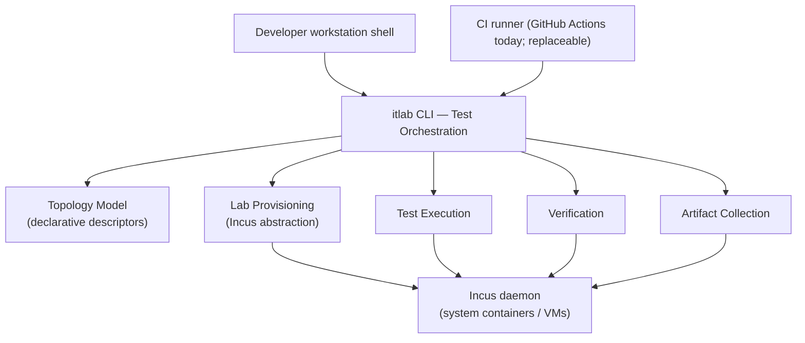
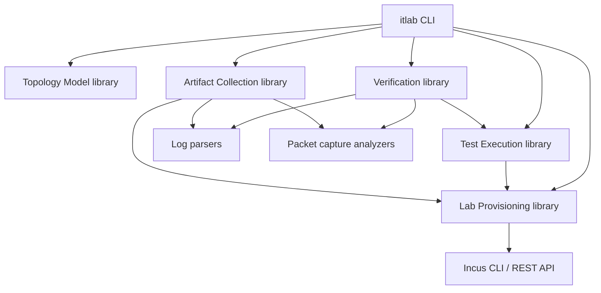
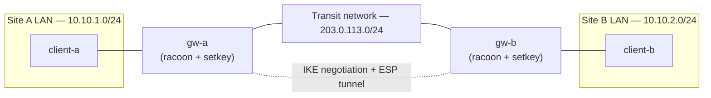
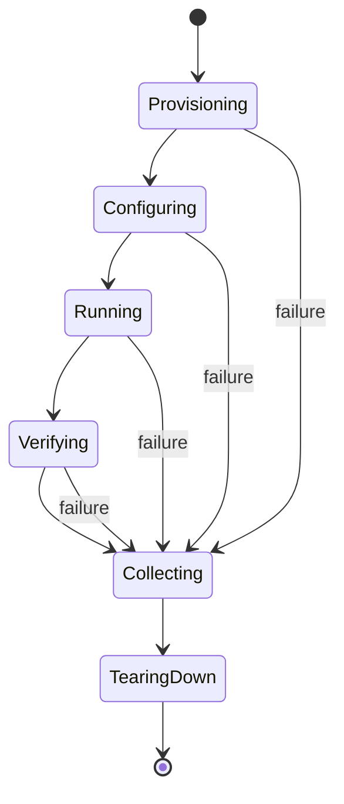
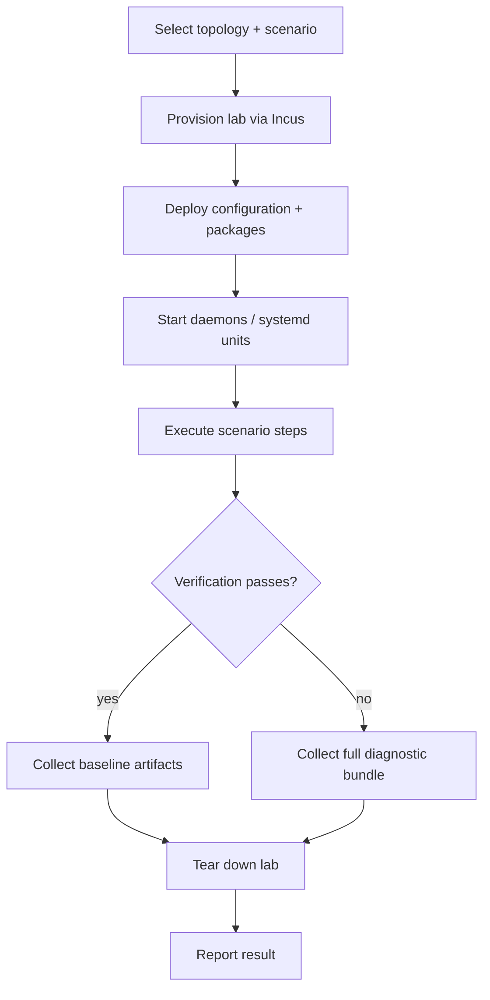

# RFC 0001: An Incus-Based Integration Testing Framework

## Status

Draft

## Authors

- Drafted via Claude Code at the request of @rdratlos

## Reviewers

- @rdratlos (decision)
- (open to community and domain-expert review — IKE/IPsec, Incus/LXC, packaging)

---

## 1. Executive Summary

This RFC establishes the architecture for **itlab**, a declarative, Incus-based
integration testing framework for Racoon IPsec Tools. It replaces ad hoc,
manually executed integration testing with automated, reproducible virtual
laboratories that exercise the full daemon lifecycle — configuration parsing,
IKE negotiation, SA establishment, kernel PF_KEY/XFRM interaction, routing,
NAT-T, certificate and PSK authentication, rekeying, and package lifecycle —
across multiple Linux distributions and network topologies.

The framework is designed as a **permanent, extensible project asset**, not a
one-off CI script. Its defining architectural commitment is that **the exact
commands a developer runs on a workstation are the exact commands CI runs** —
CI is a caller of the framework, never its implementation. Incus is adopted
as the sole virtualization backend, using system containers by default and
virtual machines only where kernel-level isolation is required, with all
Incus-specific mechanics hidden behind a stable internal API so the backend
itself remains replaceable in principle even though no replacement is
currently planned.

This RFC defines the vision, principles, layered architecture, topology and
test-lifecycle model, repository layout, and a phased implementation roadmap.
It does not implement code or CI configuration; those are left to the
implementation issues that follow acceptance of this design.

## 2. Motivation

Racoon is a protocol daemon whose correctness cannot be fully established by
unit tests alone. Unit tests (see `test/`) verify internal functions in
isolation — buffer handling, parsing, cryptographic primitives — but cannot
observe what actually matters to an operator: whether two hosts running
racoon actually negotiate an SA, whether the kernel's SPD/SAD reflects that
negotiation, whether a NAT-Traversal road-warrior client reconnects after a
network blip, or whether a Debian package upgrade leaves a running daemon in
a working state.

Today this class of testing is manual: a maintainer builds two machines (or
containers) by hand, writes ad hoc `racoon.conf`/PSK files, starts daemons,
and eyeballs `racoonctl`/`setkey -D` output. This does not scale, is not
repeatable, is not run on every change, and leaves entire categories of
behaviour — IPv6, dual-stack, mixed-distribution interoperability, package
upgrade/downgrade, systemd unit behaviour — effectively untested in practice.

The project is also in the middle of changes that specifically demand this
kind of testing: the OpenSSL 3.x migration already completed in 0.9.0 changed
cryptographic code paths that unit tests exercise in isolation but cannot
prove correct end-to-end; the PF_KEY-to-XFRM migration under discussion
(issue #4) is a kernel-interface replacement that is only safely verifiable
by observing real kernel SAD/SPD state under real negotiation traffic; and
distribution packaging spans four Ubuntu releases (Bionic through Noble)
whose install/upgrade/removal behaviour has already regressed silently more
than once (see the Bionic build regression fixed alongside this RFC).

## 3. Problem Statement

There is no deterministic, version-controlled, automatically executed way to
answer the question: *"does racoon actually establish and maintain IPsec
Security Associations correctly, across the network and daemon-lifecycle
conditions our users encounter?"*

Concretely, the project lacks automated coverage of:

- End-to-end IKE Phase 1 / Phase 2 negotiation and SA establishment between
  two independently configured daemons.
- Kernel-level verification (PF_KEY today, XFRM after issue #4) that the SPD
  and SAD reflect what racoon believes it negotiated.
- Network conditions: routing across multiple hops, NAT traversal, IPv6-only
  and dual-stack addressing.
- Authentication methods: PSK and certificate-based (PKI) authentication, and
  their failure modes.
- Lifecycle events: rekeying, daemon restart, Phase 1 renegotiation.
- Packaging: install, upgrade, and removal of the Debian package, including
  systemd unit behaviour, across supported distributions.
- Interoperability: behaviour across mixed Linux distributions (and,
  eventually, against non-racoon IPsec peers).

Any solution must be reproducible (identical results on identical inputs),
runnable by any contributor without special access, and must not become a
second, divergent CI-only test suite that nobody can run locally.

## 4. Goals

- Provide a declarative, version-controlled way to define virtual
  laboratories (hosts, networks, images, per-host configuration).
- Guarantee that local and CI execution of any test are the same operation,
  invoked through the same tooling.
- Cover, incrementally, the full behavioural surface listed in the Problem
  Statement: daemon lifecycle, IKE/SA establishment, PF_KEY/XFRM
  interaction, routing, IPv4/IPv6, NAT-T, PSK/certificate auth, rekeying,
  package install/upgrade/removal, systemd integration, and cross-distribution
  interoperability.
- Make every test run from a clean, immutable environment, so failures are
  attributable to the code under test, not to accumulated state.
- Make topologies reusable across many tests, so that adding a new test
  rarely requires adding a new topology.
- Automatically collect diagnostic artifacts (logs, packet captures,
  topology/config snapshots) on failure, without per-test instrumentation.
- Keep the framework portable across CI systems by never encoding
  GitHub-specific assumptions into the framework itself.
- Design for scale: dozens of topologies, multiple distributions and package
  formats, and eventual interoperability testing against third-party IPsec
  implementations, without architectural rework.

## 5. Non-goals

- This RFC does not implement any code, tooling, or CI configuration. It
  defines the architecture that implementation work must follow.
- This RFC does not replace the existing unit test suite in `test/`, which
  continues to cover internal function correctness. Integration tests
  complement, not replace, unit tests.
- This RFC does not select or design a topology specification language, a
  scenario DSL, or an artifact-query framework in detail — these are
  explicitly deferred to future RFCs (Section 22).
- This RFC does not commit to a specific interoperability target (strongSwan,
  Libreswan, vendor appliances, etc.); it only ensures the architecture can
  support that later without redesign.
- This RFC does not address performance/load benchmarking or fuzz testing;
  both are named as future extensions, not part of this framework's initial
  scope.
- This RFC does not mandate BSD support; NetBSD/FreeBSD compatibility is
  acknowledged as a future scalability target, not a day-one requirement,
  since Incus's primary supported host platform is Linux.
- This RFC does not decide whether the framework ultimately lives in this
  repository or a satellite repository as a permanent matter of record; it
  recommends in-tree placement (Section 11) but treats that as revisable.

## 6. Design Principles

These principles are binding on all implementation work that follows this
RFC. Each includes its rationale so future contributors can evaluate whether
a proposed change still serves the original intent.

| Principle | Statement | Rationale |
| --- | --- | --- |
| Infrastructure as Code | Labs (hosts, networks, images, configuration) are declared in version-controlled files. No manual setup step exists. | Manual setup is the failure mode this RFC exists to eliminate: it is unreviewable, undocumented, and non-reproducible. |
| Local = CI | The command a developer runs on a workstation is byte-for-byte the command CI runs. | If CI runs different tooling than developers, the CI path silently becomes the only one that is trustworthy, and locally-green/CI-red (or the reverse) becomes routine and undebuggable. |
| Incus as the virtualization backend | Incus is standard; system containers are the default, VMs are used only when kernel isolation is required. Incus specifics are hidden behind reusable tooling. | Incus provides one declarative model (projects, profiles, networks, images) spanning both containers and VMs, avoiding two backend integrations. Hiding it behind an internal API keeps the option — never a commitment — to change backend later. |
| Topology-driven testing | Tests execute against reusable, named network topologies, not one-off ad hoc setups. | Amortizes the cost of describing a network shape (site-to-site, road warrior, dual-stack, ...) across every test that needs that shape, and makes the "what environment does this test need" question answerable by name. |
| Immutable execution | Every test run starts from a clean environment; no test depends on state left by a previous run. | Order-dependence and hidden state are the two most common causes of flaky integration suites. Immutability is what makes a red run trustworthy evidence of a real regression. |
| Layered architecture | Responsibilities are split across CI orchestration, test orchestration, lab provisioning, topology, execution, verification, and artifact collection, each with a narrow, stable contract to its neighbours. | Narrow contracts are what let each layer evolve (e.g. swap Incus internals) without forcing changes in the layers above or below it. |
| Portability | The framework must run unmodified from GitHub Actions, a local shell, or a future CI system. | GitHub Actions is a caller, not a foundation; project continuity must not depend on one CI vendor's availability or feature set. |
| Observability | Every failed test automatically yields daemon logs, systemd logs, kernel logs, packet captures, the topology description, and the configuration in effect. | A failure that cannot be diagnosed from its own artifacts will be re-run by hand under a debugger exactly once, and then quietly stop being trusted. |
| Scalability | The architecture anticipates dozens of topologies, multiple distributions and package formats, future BSD hosts, kernel-compatibility testing, and third-party interoperability testing. | Retrofitting scale into a framework designed for a handful of cases is more expensive than designing the seams in from the start, even though the first release only populates a handful of cases. |

## 7. Overall Architecture

At the highest level, a single orchestration surface — the **itlab CLI** — is
invoked identically by a developer's shell and by a CI job. It reads
declarative topology and scenario definitions, drives Incus to provision a
lab, executes the scenario against it, verifies outcomes, collects
artifacts, and tears the lab down. Nothing above the CLI (a human, or a CI
job) is architecturally distinguished from anything else that could invoke
it.



The CLI is the only component that knows about all the others; no layer
below it depends on a layer above it, and CI-specific concerns (job
matrices, artifact upload endpoints, status checks) exist only in the thin
glue that invokes the CLI, never inside it.

## 8. Layered Architecture

| Layer | Responsibility | Does *not* do |
| --- | --- | --- |
| CI Orchestration | Trigger runs on the events the CI vendor supports (push, PR, schedule); pass parameters (topology, scenario, distro matrix) to the CLI; publish the CLI's own artifacts/exit code as vendor-specific status. | Contain any test logic, Incus knowledge, or assertions. If this layer grows opinions about *what* to test, that logic has leaked out of the framework. |
| Test Orchestration (itlab CLI) | Parse invocation parameters; resolve a topology + scenario pair; sequence the layers below through the test lifecycle (Section 10); aggregate and report results. | Talk to Incus directly, or contain protocol/verification knowledge — it delegates both. |
| Lab Provisioning | Translate a topology descriptor into Incus objects: project, network(s), profile(s), instances (containers or VMs), image selection. Own creation and teardown. | Know what a "scenario" is, or what success looks like — it only knows how to stand up and tear down the declared shape. |
| Network Topology | Define reusable host/network shapes (roles, addressing, links, per-role config templates) as data, independent of any specific test. | Execute anything. Purely declarative. |
| Test Execution | Drive the scenario: push configuration/packages into provisioned instances, start/stop daemons and systemd units, trigger traffic, wait for negotiation. | Decide pass/fail — it produces observations, not verdicts. |
| Verification | Assert expected outcomes against observations: kernel SPD/SAD state, daemon logs, packet captures, process/service state. | Provision, execute scenario steps, or collect artifacts — it only judges. |
| Artifact Collection | On every run (and unconditionally in full on failure), gather daemon logs, systemd journal excerpts, kernel logs, packet captures, the topology description, and effective configuration into a structured bundle. | Interpret the artifacts — that is left to the human or future tooling (Section 22) consuming the bundle. |

Each layer communicates with its neighbours through a small, explicit data
contract (e.g. "a topology descriptor," "a provisioned lab handle," "a
verification result") rather than a shared mutable context, so any single
layer's internals can change without the others noticing.

Internally, the `itlab` CLI (Section 12) is a thin sequencer over one
library per layer, mirroring the `lib/` layout proposed in Section 11. The
dependency direction only ever points from a higher layer to a lower one —
never the reverse — which is what makes each library independently
testable and replaceable:



## 9. Topology Model

A **topology** declares a network shape and the roles that occupy it:
which hosts exist, what images/distributions they run, how they are
addressed and connected, and what configuration template each role uses. A
topology is deliberately silent about *what is being tested* — that is the
job of a **scenario**, which is layered on top of a topology and supplies
the steps and assertions specific to one behaviour.

This separation is what makes topologies reusable: the same `site-to-site`
topology backs a "basic negotiation" scenario, a "rekeying" scenario, and a
"Phase 1 renegotiation" scenario without being redefined three times.

Representative topologies this framework must eventually support:

| Topology | Purpose |
| --- | --- |
| `site-to-site` | Two gateways, each fronting a private subnet, connected by an ESP tunnel. |
| `road-warrior` | One gateway, one roaming client with a dynamic address. |
| `nat-traversal` | Road-warrior or site-to-site with a NAT device interposed. |
| `ipv6-only` | Site-to-site over IPv6 addressing exclusively. |
| `dual-stack` | Site-to-site where peers negotiate over both IPv4 and IPv6. |
| `multi-hop-routing` | Traffic between protected subnets crosses intermediate routed hops. |
| `cert-pki` | Site-to-site or road-warrior authenticated via a test PKI. |
| `psk` | Authentication via pre-shared key (the default for most other topologies unless testing auth itself). |
| `mixed-distro` | Peers run different supported Linux distributions/package versions. |

A topology descriptor is illustrative data, not a committed schema (the
schema itself is future work, Section 22); a sketch:

```yaml
# illustrative only — not a committed schema
name: site-to-site
roles:
  gw-a:
    image: ubuntu/noble
    networks: [transit, site-a-lan]
    config_template: roles/gateway.racoon.conf.tmpl
  gw-b:
    image: ubuntu/noble
    networks: [transit, site-b-lan]
    config_template: roles/gateway.racoon.conf.tmpl
  client-a:
    image: ubuntu/noble
    networks: [site-a-lan]
  client-b:
    image: ubuntu/noble
    networks: [site-b-lan]
networks:
  transit:    { subnet: 203.0.113.0/24 }
  site-a-lan: { subnet: 10.10.1.0/24 }
  site-b-lan: { subnet: 10.10.2.0/24 }
```



## 10. Test Lifecycle

Every test — regardless of topology or scenario — passes through the same
sequence of states. This uniformity is what lets the Test Orchestration
layer sequence arbitrary topology/scenario pairs without per-test special
casing, and it is what guarantees artifact collection happens even when a
test fails partway through provisioning or execution.



- **Provisioning** — Incus project, network(s), and instances are created
  from the topology descriptor.
- **Configuring** — per-role configuration (racoon.conf, PSK/certificates,
  package installation) is deployed into each instance.
- **Running** — daemons/systemd units are started and the scenario's steps
  execute (trigger traffic, initiate negotiation, wait for expected state,
  simulate rekey/restart/upgrade events as the scenario requires).
- **Verifying** — expected outcomes are asserted against observed state
  (kernel SPD/SAD, logs, packet captures, process/service status).
- **Collecting** — artifacts are gathered. This state is reached from every
  other state on failure, not only from a successful Verifying state, so a
  provisioning failure is exactly as diagnosable as a verification failure.
- **Tearing Down** — the lab (project, networks, instances) is destroyed
  unconditionally. Immutable execution means the next run never inherits
  this run's state, whether it passed or failed.



## 11. Repository Layout

The framework is placed in-tree, under `test/itlab/`, alongside the existing
unit test suite in `test/`. This keeps a feature and the integration tests
that validate it landing in the same pull request and reviewed together,
and avoids coordinating releases/versioning across two repositories for a
framework that, at this stage, has exactly one consumer. (Section 17
discusses the alternative of a satellite repository and why it is deferred
rather than rejected.)

```
test/itlab/
    README.md                  # how to add a topology/scenario; how to run locally
    itlab                      # single CLI entry point (Test Orchestration layer)
    lib/
        provisioning/          # Incus abstraction (Lab Provisioning layer)
        topology/              # topology descriptor loading/validation
        execution/             # scenario step execution
        verification/          # SPD/SAD, log, and packet-capture assertions
        artifacts/             # artifact collection and bundling
    images/                    # per-distribution base image definitions
    topologies/
        site-to-site/
        road-warrior/
        nat-traversal/
        ipv6-only/
        dual-stack/
        multi-hop-routing/
        cert-pki/
        psk/
        mixed-distro/
    scenarios/
        ike-negotiation-basic/
        rekey-phase1/
        rekey-phase2/
        phase1-renegotiation/
        daemon-restart/
        package-install-upgrade-remove/
    ci/
        run-integration.sh     # thin glue invoked by CI; calls itlab, nothing else
    artifacts/                 # gitignored — runtime output only
```

Directory responsibilities:

- **`itlab`** is the only supported entry point; nothing outside it is meant
  to be invoked directly by a human or by CI.
- **`lib/`** holds one directory per architectural layer from Section 8,
  keeping the layering visible in the filesystem, not just in prose.
- **`topologies/`** and **`scenarios/`** are data-plus-template directories;
  adding a new one should not require touching `lib/`.
- **`images/`** isolates per-distribution image build/selection logic so
  adding a distribution is additive.
- **`ci/`** contains the only files that may reference the CI vendor by
  name, and each is a thin wrapper whose entire body is "call `itlab` with
  these parameters." This is the enforcement point for the Local = CI
  principle: if `ci/run-integration.sh` grows logic beyond argument
  translation, that is itself a defect against this RFC.

## 12. Execution Model

A single command shape runs any topology/scenario pair, identically whether
invoked by a developer or by CI:

```
itlab run <topology> <scenario> [--distro <name>] [--keep-on-failure]
```

CI's job is limited to: install/verify Incus availability, check out the
repository, invoke `itlab run` with the matrix parameters for that job, and
upload whatever `itlab` placed under `artifacts/`. No step of that sequence
is meaningfully different from what a contributor does locally except that
a human typically inspects a failed lab interactively (`--keep-on-failure`
skips the Tearing Down state) rather than only reading the uploaded bundle.

Because the CLI — not the CI job — owns provisioning, execution,
verification, and artifact collection, replacing the CI vendor means
rewriting the thin glue in `ci/`, never the framework. This is the concrete
mechanism behind the Portability principle (Section 6).

## 13. Artifact Collection

Artifact collection is a cross-cutting concern invoked from the Collecting
state (Section 10) regardless of which prior state failed. A collected
bundle contains, per instance in the lab:

- racoon/racoonctl daemon logs.
- The relevant systemd journal excerpt (`journalctl -u racoon`, package
  install/upgrade/removal transcripts).
- Kernel log excerpts (`dmesg`/`journalctl -k`) covering the run window.
- Packet captures taken on every network segment in the topology for the
  duration of the Running state.
- The topology description as resolved for this run (including any
  per-run parameterization), so an artifact is self-describing without
  cross-referencing the repository state at some past commit.
- The effective configuration deployed to each instance (racoon.conf,
  redacted PSK/cert material as appropriate).

On success, a minimal baseline bundle (logs only) is retained so that
intermittent, hard-to-reproduce failures still have a recent healthy
baseline to diff against; on failure, the full bundle described above is
always collected. This distinction keeps storage cost bounded without
sacrificing diagnosability precisely when it matters.

## 14. Failure Analysis

Because artifact collection is state-agnostic (Section 10), a failure
during Provisioning yields Incus/host diagnostics, a failure during
Configuring yields the deployment logs and partial configuration state, and
a failure during Running or Verifying yields the full bundle from Section
13. This means the question "why did this fail" never depends on which
lifecycle state failed — it is always answerable from the same kind of
bundle, which is what makes the framework usable by contributors who were
not present when the failure occurred.

The framework does not attempt automated root-causing in its initial scope;
Section 22 lists a future "artifact collection framework" RFC as the place
where structured, queryable failure analysis (e.g. classifying a failure as
"negotiation timeout" vs. "kernel SA mismatch" automatically) belongs.

## 15. Security Considerations

- **Elevated privilege requirement.** Incus requires the invoking user to
  hold `incus` group membership (or root), and manipulating kernel SPD/SAD
  state (PF_KEY today, XFRM after issue #4) requires `CAP_NET_ADMIN` inside
  the instance. This is inherent to what the framework tests, not a
  framework-specific escalation, but it does mean CI runners must be
  dedicated or ephemeral, never shared with untrusted workloads.
- **Blast-radius isolation.** Each run provisions its lab inside a
  dedicated Incus project with its own network(s), so a misbehaving test
  cannot reach the host's other networks or a concurrently running lab.
  Immutable execution (Section 6) additionally guarantees no credential or
  state from a previous run is reachable by the next.
- **Test-only credentials.** All PSKs and certificates used by topologies
  are generated fixtures scoped to the test PKI/topology, never real
  operator secrets, and are destroyed with the lab at Tearing Down.
- **Untrusted-input surface is unchanged.** The framework does not expand
  racoon's own attack surface; it exercises the same daemon a real deployment
  runs. Its own risk is host/CI-runner compromise via the elevated
  privileges above, mitigated by isolation and by running on runners
  provisioned specifically for this purpose.
- **Secure defaults.** Topologies default to the strongest authentication
  and cipher configuration the scenario under test allows; weak
  configurations (e.g. deliberately broken PSKs for negative testing) must
  be explicit, scenario-local, and never inherited as a topology default.

## 16. Performance Considerations

- **Container-first by design.** System containers start in low
  single-digit seconds versus tens of seconds for VMs; defaulting to
  containers (Section 6) keeps the common case — most topologies do not
  need kernel isolation — fast, reserving the VM cost for the scenarios that
  actually require it (e.g. testing a different kernel version than the
  host's).
- **Image reuse.** Per-distribution base images (Section 11) are built once
  and reused across runs; provisioning a topology should be dominated by
  instance creation and configuration deployment, not image assembly.
- **Isolation enables parallelism.** Because each lab owns its own Incus
  project and network(s) (Section 15), independent topology/scenario runs
  can execute concurrently on one host without cross-talk, which is the
  basis for scaling test suite wall-clock time horizontally rather than
  only vertically.
- **Snapshot/reprovision trade-off is scenario-dependent** and is discussed
  explicitly in Section 17 rather than decided uniformly here: some
  scenarios (e.g. package upgrade testing) are inherently about the
  transition from one provisioned state to another and cannot use a
  post-configuration snapshot as their starting point, while most
  negotiation-only scenarios can.
- **No performance benchmarking in scope.** This framework proves
  correctness, not throughput or latency; a dedicated benchmarking harness
  is future work (Section 22) so that its very different concerns
  (repeatable measurement, statistical noise control) do not distort this
  framework's design.

## 17. Alternatives Considered

| Alternative | Advantages | Disadvantages | Why rejected / deferred |
| --- | --- | --- | --- |
| Docker / Docker Compose | Ubiquitous, huge ecosystem, familiar to most contributors. | Weak systemd support inside containers; awkward multi-network-namespace topologies; no native VM story for kernel-isolated scenarios. | IPsec/XFRM testing and systemd package-lifecycle testing are both core requirements this backend fits poorly. |
| Vagrant + VirtualBox/libvirt | Mature, well understood, full kernel isolation always available. | Every instance pays VM boot cost even when a container would do; two abstractions (Vagrant + provider) instead of one. | Incus gives one declarative model spanning containers and VMs, avoiding the "always pay VM cost" penalty for the common case. |
| GitHub Actions matrix + cloud VM tooling (e.g. cloud-init, ephemeral cloud instances) | No local tooling to maintain; scales via a cloud provider. | Ties the framework's execution model to GitHub/cloud specifics, directly violating the Local = CI and Portability principles. | Rejected on principle, not on capability — it would work, but only for CI, which is the failure mode this RFC exists to avoid. |
| Molecule (Ansible role testing) | Purpose-built test lifecycle tooling, existing ecosystem. | Oriented around testing Ansible roles/converge idempotency, not general multi-host network-topology and kernel-IPsec verification. | Wrong problem shape; would require fighting the tool more than using it. |
| Terraform + libvirt provider | Declarative, IaC-native, general-purpose. | Heavier abstraction than needed at this scale; slower iteration loop for fast, ephemeral dev/test cycles; introduces a second DSL (HCL) alongside topology descriptors. | Incus's native project/profile/network model is a closer, simpler fit for ephemeral, fast-cycling lab instances. |
| Satellite repository for the framework (vs. in-tree `test/itlab/`) | Enables reuse by other IPsec projects; independent release cadence. | Coordinating two repositories' versions for a framework with exactly one consumer today; feature PRs and their integration tests would live in different repositories and review streams. | Deferred, not rejected: Section 11 recommends in-tree placement now; extraction to a satellite repository remains available later if a second consumer materializes, without redesigning the framework itself (see Section 18). |
| Do nothing (continue manual integration testing) | Zero implementation cost. | Leaves the Problem Statement (Section 3) entirely unaddressed; already-observed regressions (Bionic build breakage, PF_KEY/XFRM correctness) recur silently. | Explicitly rejected; this RFC exists because the cost of inaction is now higher than the cost of building the framework. |

## 18. Migration Strategy

There is no existing automated integration suite to migrate *from* — this is
new capability, not a replacement, so migration here means **phased
introduction** rather than cutover:

1. The framework is introduced without being a required CI check. Existing
   unit tests (`test/`) and build/package CI remain the only required gates
   until the framework demonstrably covers its first topology/scenario
   reliably.
2. As topology coverage grows (Section 21), individual scenarios are
   promoted to required-check status one at a time, not as a single
   all-or-nothing switch.
3. Any pre-existing informal/manual test procedures (maintainer notes,
   ad hoc scripts) that this framework supersedes are documented as
   superseded in `test/itlab/README.md` and archived, not silently deleted,
   so the institutional knowledge they encode is not lost even after the
   manual procedure itself is retired.
4. If a satellite-repository extraction (Section 17) is ever undertaken, it
   is itself a future RFC, not a silent infrastructure change — the
   in-tree/satellite boundary is treated as a reviewable architectural
   decision, not an implementation detail.

## 19. Open Questions

- What minimum Incus version should be required, and how is that
  requirement enforced/detected across contributor workstations and CI
  runners?
- Should `itlab` be implemented as a shell-based CLI, or in a language with
  stronger structured-data handling (relevant to topology/scenario
  parsing and verification logic)? This RFC deliberately does not decide
  implementation language.
- How are per-distribution base images built and refreshed over time (own
  build pipeline vs. consuming upstream cloud images directly)?
- What is the concrete resource budget (CPU/memory/disk) assumed for CI
  runners, and does it bound how many topologies/scenarios can run
  concurrently in one CI job?
- At what point (if ever) does a second consumer justify extracting the
  framework into a satellite repository, per Section 17's deferred
  alternative?
- How should the framework represent a scenario's dependency on a
  not-yet-implemented racoon feature (e.g. XFRM support from issue #4)
  before that feature lands — as a topology-level skip, or a scenario-level
  expected-failure marker?
- Should verification (Section 8) be permitted to assert on packet capture
  contents in the initial scope, or is that better deferred until the
  Verification layer's assertion vocabulary is more mature?

## 20. Acceptance Criteria

- [ ] This RFC is accepted (merged per the project's RFC process,
      `docs/rfcs/README.md`).
- [ ] The layered architecture (Section 8) is reflected 1:1 in the
      `test/itlab/lib/` directory structure once implemented.
- [ ] `itlab run <topology> <scenario>` executes identically (same
      artifacts, same exit-code semantics) from a local shell and from a CI
      job, for at least one topology/scenario pair.
- [ ] A failed run automatically produces the full artifact bundle
      described in Section 13 without any per-scenario instrumentation.
- [ ] Every run starts from a freshly provisioned lab; no scenario or
      topology implementation may assume state from a prior run.
- [ ] Adding a new topology or scenario is documented in
      `test/itlab/README.md` and does not require changes to `lib/`.
- [ ] At least the `site-to-site` and `road-warrior` topologies and the
      `ike-negotiation-basic` scenario are implemented and passing before
      this framework is referenced as covering any specific issue (e.g.
      issue #4's XFRM migration).
- [ ] The CI glue in `test/itlab/ci/` contains no logic beyond parameter
      translation into `itlab` invocations.

## 21. Implementation Roadmap

Each milestone below produces a working, demonstrable intermediate result;
none depends on completing a later milestone first.

1. **Bootstrap.** Incus abstraction (Lab Provisioning layer) and the `itlab`
   CLI skeleton; one topology (`site-to-site`); one scenario
   (`ike-negotiation-basic`) using PSK authentication over IPv4. Proves the
   full lifecycle (Section 10) end to end.
2. **Verification and artifacts.** Implement the Verification layer (kernel
   SPD/SAD assertions, log assertions) and the Artifact Collection layer
   (Section 13) against the Milestone 1 scenario, including the failure
   path (`--keep-on-failure`, full bundle collection).
3. **Topology expansion.** Add `road-warrior`, `nat-traversal`, `ipv6-only`,
   `dual-stack`, and `cert-pki` topologies, plus the `rekey-phase1`,
   `rekey-phase2`, and `phase1-renegotiation` scenarios.
4. **Lifecycle and packaging.** Add `daemon-restart` and
   `package-install-upgrade-remove` scenarios, including systemd unit
   assertions, across the distributions the project packages for
   (Bionic through Noble at minimum).
5. **Interoperability breadth.** Add the `mixed-distro` topology, running
   the existing scenarios across mixed-distribution pairs rather than
   same-distribution pairs.
6. **CI integration.** Wire the framework into CI (`test/itlab/ci/`) as an
   optional check first, then promote individual scenarios to required
   status per the phased approach in Section 18.
7. **Documentation and contributor onboarding.** Finalize
   `test/itlab/README.md` covering how to add a topology, a scenario, and
   how to debug a failed run locally using the artifact bundle.

## 22. Future Extensions

This RFC intentionally leaves the following for future, narrower RFCs that
build on the architecture defined here:

- **Topology specification language** — a formal, validated schema for
  topology descriptors (Section 9 shows only an illustrative sketch).
- **Integration test DSL** — a structured way to express scenario steps and
  assertions beyond ad hoc scripting.
- **Artifact collection framework** — structured, queryable failure
  artifacts (Section 14's deferred automated failure classification).
- **Interoperability testing** — topologies and scenarios pairing racoon
  against third-party IPsec implementations (strongSwan, Libreswan, vendor
  appliances).
- **Distributed execution** — sharding topology/scenario runs across
  multiple hosts or runners as the suite grows past what one host should
  run serially.
- **Performance benchmarking** — a dedicated harness for throughput/latency
  measurement, deliberately kept separate from this correctness-focused
  framework (Section 16).
- **Fuzz testing** — structured fuzzing of IKE message handling, layered on
  top of the lab infrastructure this RFC defines.
- **Fault injection and network impairment simulation** — deliberate packet
  loss, latency, and reordering (e.g. via `tc netem`) within topologies, to
  test racoon's resilience rather than only its happy-path correctness.

## References

- `docs/rfcs/README.md` — the project's RFC process this document follows.
- `test/Makefile.am` and `test/README.md` — the existing unit test suite
  this framework complements rather than replaces.
- `.github/workflows/build-test.yml` — the existing build/unit-test CI this
  framework's CI glue (Section 12) sits alongside, not inside.
- Issue #4 — PF_KEY-to-XFRM migration, a primary motivating example for
  kernel-level verification (Section 15).
- Issue #7 — ESP `hmac_sha256` ICV truncation under PF_KEY, an example of a
  defect only observable through real kernel SA state, not unit testing.
- Incus documentation — <https://linuxcontainers.org/incus/docs/main/>
